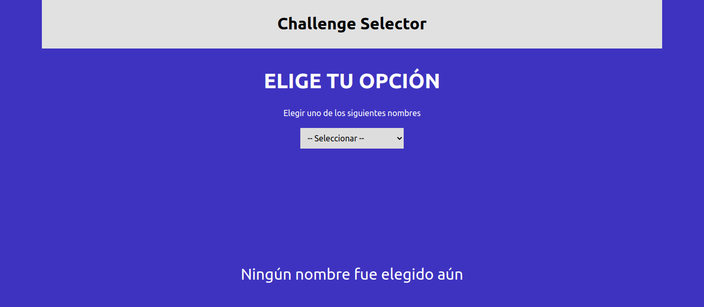

# Challenge

## Screenshots



## Used elements

### [Public API](https://jsonplaceholder.typicode.com "JSONPlaceholder")

## Installation

* **gh CLI**

```cmd
gh repo clone norbix14/challenge-selector selector
```

* **git**

```cmd
git clone https://github.com/norbix14/challenge-selector.git selector
```

* go to folder

```cmd
cd selector/
```

* install dependencies

```cmd
npm i
```

* run development mode

```cmd
npm run dev
```

* build

```cmd
npm run build
```

* run project in production mode

```cmd
serve -s -l 4000 dist/
```
